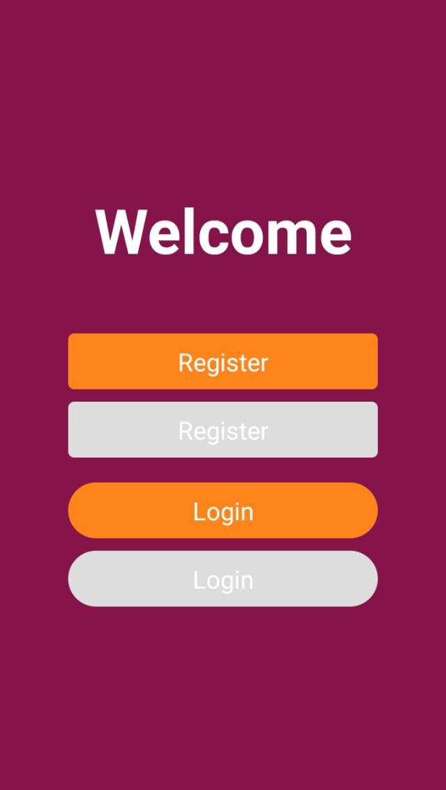

# React Native Template

A template for fast start development of react native apps.

## Packages & Features

- [Expo](https://expo.io)
- [Typescript](https://www.typescriptlang.org)
- [React Navigation v5](https://reactnavigation.org)
- [Mobx](https://mobx.js.org/)
- [Mobx React](https://github.com/mobxjs/mobx-react)
- [Lottie](https://airbnb.design/lottie)
- [Axios](https://github.com/axios/axios)

## Custom Components

```jsx
import * as View from '~/components/view';
import * as Text from '~/components/text';
import * as Button from '~/components/button';

export default () => (
  <View.Center flex={1} color="maroon">
    <Text.Bold size={50} color="white">
      Welcome
    </Text.Bold>
    <View.Center mt={50}>
      <Button.Flat text="Register" />
      <Button.Flat text="Register" mt={10} disabled />
    </View.Center>
    <View.Center mt={20}>
      <Button.Rounded text="Login" />
      <Button.Rounded text="Login" mt={10} disabled />
    </View.Center>
  </View.Center>
);
```

This produces a screen like


